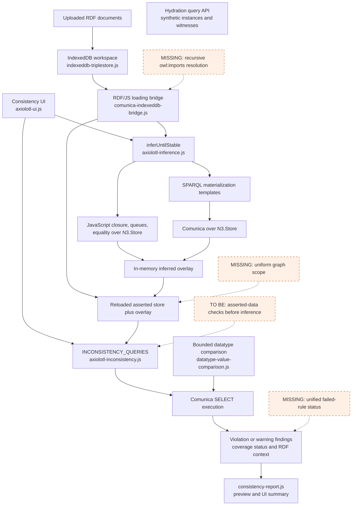
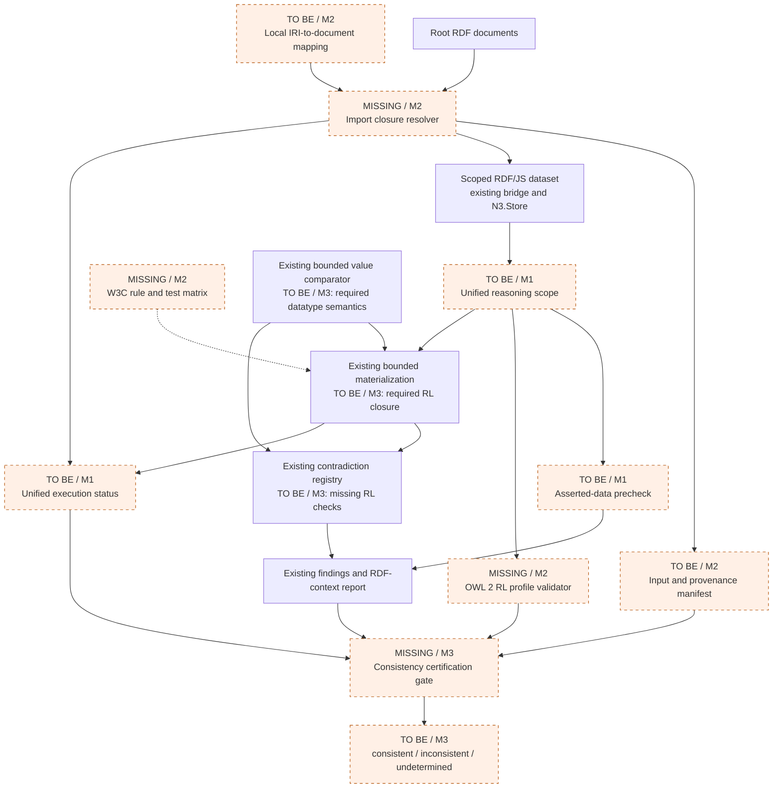

# Consistency checking: implementation instructions and three milestones

Snapshot: 2026-10-08, Axiolotl feature branch
`find-inconsistency-or-unsatisfiable-axiom`, commit `139e99a`.
This document records the agreed direction; it does not claim future capabilities
are implemented. Update the snapshot, evidence, and checklists as work lands.

## Scope and finish lines

Maintain standalone Axiolotl and port completed increments to the Axiolotl sub-app
in ReasonLynx. Ontology consistency is the reasoning task. General class
satisfiability, synthetic class probing, and complete OWL 2 DL reasoning are out
of scope. Do not infer a supported OWL profile from the names of UI presets.

| Milestone | Deliverable | Permitted claim |
| --- | --- | --- |
| M1 | Reliable consistency checks v1; standalone release and ReasonLynx port | Detects the documented contradiction patterns; no findings does not certify consistency. |
| M2 | Import closure, profile gate, and W3C rule conformance foundation | Reports the complete input closure and its profile/support status; certification is still unavailable. |
| M3 | Validated OWL 2 RL consistency decision pipeline | May return consistent for validated, supported OWL 2 RL inputs only after all certification gates pass. |

OWL 2 RL is the target because it fits the rule-based architecture, not because
it is already supported or is universally the easiest profile. The
[W3C profiles specification](https://www.w3.org/TR/owl2-profiles/) defines the
profile syntax and the
[RL/RDF rules](https://www.w3.org/TR/owl2-profiles/#Reasoning_in_OWL_2_RL_and_RDF_Graphs_using_Rules).
Audit the applicability conditions of those rules and the selected semantics;
implementing some contradiction rules is not enough to certify consistency.

## Where we are

- Local standalone `master` received the monorepo standardization work. That
  master was merged into the feature branch. ReasonLynx has not received the
  subsequent consistency additions during this work.
- Registry: 12 checks, comprising 10 violation checks and two heuristic warnings.
- Public consistency manifest: 70 fixtures. Six additional class-recognition
  fixtures live in the materialization fixture folder.
- Last observed verification: ESLint passed; 95 Jest tests in ten suites passed.
  Several suites execute the shipped N3/Comunica bundles, but the entire fixture
  manifest is not yet executed through the full UI-equivalent pipeline.
- Equality propagation preserves blank-node identity. Class recognition from
  `owl:hasValue` and `owl:someValuesFrom` now requires explicit equivalence, rather
  than reversing a subclass axiom.
- Bounded datatype comparison supports `xsd:string`, `rdf:langString`,
  `xsd:boolean`, `xsd:decimal`, and the `xsd:integer` family. It uses exact arithmetic
  and reports unsupported/invalid comparisons as incomplete coverage.
- Single-property keys enforce named subjects and named object-key witnesses,
  and recognize equality aliases and known inequality. Multi-property keys remain
  unsupported.
- Findings distinguish warnings and violations. Reports include query, bindings,
  RDF context, graph scope, phase, and supplied asserted/materialized origin.
  This is contextual evidence, not a minimal proof or full derivation trace.

The detailed check boundaries remain in
[the coverage map](inference-and-inconsistency-coverage.md).
The existing query-folder `.rq` files are not the source of truth for every rule:
materialization query templates and the inconsistency registry also live in JS.

## Current architecture

Solid arrows are current execution paths. Dashed arrows identify missing work;
they do not indicate that it runs today.

Hydration is intentionally disconnected: the normal UI does not invoke it.
Creating synthetic instances for every class changes the assumptions of the
ontology and must not become part of ordinary consistency certification.
The UI currently materializes before checking; the asserted-data precheck is
planned. Import declarations are recorded as metadata, not recursively loaded.

## Work order and dependencies

This is an ordering diagram, not a calendar or effort estimate. Start M2 audit
work earlier if helpful, but do not announce certification before M3 gates pass.

```mermaid
flowchart LR
  A["Current tested check registry"] --> B["M1: normalize graph scope"]
  B --> C["M1: propagate failures and precheck"]
  C --> D["M1: full fixture pipeline and smoke tests"]
  D --> E["M1 gate: standalone release<br/>then ReasonLynx port"]
  E --> F["M2: W3C rule audit and import closure"]
  F --> G["M2: profile validation and input manifest"]
  G --> H["M2 gate: closure and profile tested"]
  H --> I["M3: complete required RL reasoning"]
  I --> J["M3: conformance and independent comparisons"]
  J --> K["M3 gate: guarded consistency verdict"]
```

### M1 — Finish reliable pattern-based consistency checks

Freeze additional rule coverage while completing these tasks:

1. Define one scope contract used by loading, JavaScript materialization, SPARQL,
   checks, and evidence collection. For the normal workspace, axioms and instances
   from separate uploaded graphs must meet. Preserve source graphs for provenance;
   do not silently persist a flattened replacement of user data. Retain explicit
   default/named scope as separate selectable semantics.
2. Replace whole-pattern default-or-one-named-graph matching with the intended
   union behavior. Test cross-graph joins, graph isolation, blank-node identity,
   and overlays. Correct custom rule selection so the seed/queue stage cannot
   run disabled rule families silently.
3. Propagate individual rule failures to the run status. Preserve partial findings
   and errors; never turn a failed rule into an apparently clean completed check.
   Treat the pass limit and unsupported datatype comparisons as incomplete runs.
4. Execute direct checks against the asserted snapshot first. Report early
   contradictions; continuing can collect additional evidence. Then materialize
   and recheck. Preserve early results if inference fails. Give findings phase
   identifiers and distinguish repeated evidence from new contradictions.
5. Execute every consistency manifest fixture through the actual N3/Comunica
   pipeline, honoring declared rules and before/after expectations. Include
   unsupported-value notices, materialization regressions, and graph-scope cases.
6. Smoke-test isolated and combined fixtures in the standalone browser. Add a
   disjointness contradiction exposed by domain/range/subclass propagation.
   Keep warning counts separate; no-findings text must retain its coverage limit.
7. Update docs and validate the final snapshot. Merge into standalone `master`
   after verification. Port only the feature delta into current ReasonLynx,
   adapting package paths and preserving its storage/header integration. Validate
   the same semantic fixtures in both apps before calling M1 complete.

M1 acceptance: all seven steps are verified, no failed work is reported as a
successful check, and both deployment forms preserve the documented behavior.
Do not add an OWL 2 profile certification badge at this gate.

### M2 — Establish closure and conformance foundations

1. Create a separate W3C matrix, preserving the existing property coverage tables.
   Include every relevant RL/RDF rule ID, primary reference, implemented/partial/
   missing status, implementation location, positive/control/interaction tests,
   semantic limitations, and dependency rules. Mark exclusions only with a
   documented semantic justification. Do not equate a tested pattern with full
   implementation of a W3C rule.
2. Implement recursive `owl:imports` resolution, using existing RDF parsing and
   storage adapters. Support local document mappings as well as retrievable URLs;
   browser CORS failures need a visible resolution path. Resolve relative IRIs
   against the correct document base. Detect cycles, reuse loaded documents,
   preserve document-local blank-node identity, and record aliases/redirects,
   requested IRIs, effective locations, and content identity.
3. Produce an immutable run input manifest: root documents, recursively resolved
   imports, content hashes or equivalent identities, parse failures, retrieval
   failures, graph mappings, and declared reasoning scope. Unresolved imports
   block a positive consistency certificate. Deliberately excluding imports must
   be labeled a different dataset check, not certification of the root ontology.
4. Implement or integrate an OWL 2 RL structural/profile validator over the closure,
   including profile grammar and applicable global restrictions. Arbitrary RDF
   pattern matching is not enough to establish OWL profile membership. Record the
   selected semantics, datatype requirements, and unsupported features separately
   from whether the ontology meets the profile syntax.
5. Test nested/cyclic/duplicate imports, local mappings, redirects, offline or
   denied retrieval, malformed documents, out-of-profile inputs, and datatype
   limitations. Build pinned independent-reasoner comparison tooling; comparisons
   supplement rather than replace the rule audit and semantic argument.

M2 acceptance: closure and profile/support status are reproducible, failures are
explicit, and the W3C matrix inventories every remaining certification gap.
Passing these gates still does not mean the current engine certifies consistency.

### M3 — Reach OWL 2 RL consistency certification

1. Use the matrix to implement every reasoning dependency needed to decide RL
   consistency, not only rules whose conclusion is a contradiction. Prioritize
   equality, class/property equivalence, expression propagation, property chains,
   keys/cardinality, negative assertions, and datatype semantics by dependency.
2. Implement the missing contradiction rules. Keep each property in its own
   documentation row, with prefixes and code formatting. Preserve explicit
   inequalities and open-world semantics; different names alone prove nothing.
3. Audit generalized RDF/internal term handling and datatype-value semantics
   against the selected RL/RDF strategy. Current serialization guards that discard
   invalid ordinary RDF output cannot be assumed sufficient for all internal
   consequences required by the W3C rules. Internal reasoning facts and exportable
   RDF may need separate representations.
4. Add tests for each rule and its interaction dependencies. Include boundary,
   adversarial, equality-cycle, datatype, import, and resource-limit cases. Compare
   eligible OWL 2 RL fixtures with pinned HermiT/Pellet runs. Record disagreements
   and resolve them; matching a finite benchmark alone is not a completeness proof.
5. Gate the positive verdict on validated profile membership, fully resolved
   imports, supported required datatype semantics, complete execution, and the
   audited consistency procedure. Return `consistent`, `inconsistent`, or
   `undetermined`. A contradiction can be retained even if collecting all findings
   fails, but an unsupported/failed run must never return `consistent`.
6. Include input manifest identity, profile validation outcome, semantics, engine
   version, rule coverage version, run status, and evidence in the certificate.
   Release and port the same tested implementation to both deployment forms.

M3 acceptance: the matrix has no unexplained consistency-relevant gaps, the
procedure has an explicit semantic justification, independent tests agree on
eligible inputs, and every certification gate is enforced. If datatypes or
constructs remain excluded, name the supported fragment accurately; do not claim
unqualified OWL 2 RL certification. EL/QL/DL support requires its own later audit.

## Target architecture: placement of missing capabilities

| Capability | Current gap | Architecture placement | Milestone |
| --- | --- | --- | --- |
| Uniform graph scope | **Missing** cross-graph semantics | Dataset view shared by materializer, checks, evidence | M1 |
| Failure propagation | **Missing** per-rule failure aggregation | Run orchestrator and report status | M1 |
| Asserted-data precheck | **To be** implemented | Orchestrator before inference | M1 |
| Full fixture execution | **Missing** manifest-wide pipeline coverage | Jest integration harness | M1 |
| Import closure | **Missing** recursive loading | Document loader before dataset/profile validation | M2 |
| Profile validation | **Missing** structural validation | Certification eligibility gate | M2 |
| W3C rule matrix | **Missing** rule-ID conformance inventory | Docs and machine-readable test inventory | M2 |
| `owl:sameAs` predicate replacement | **Missing** | Equality layer and internal facts | M3 |
| `owl:equivalentClass` reverse propagation | **Partial** | Materialization rule registry | M3 |
| `owl:equivalentProperty` reverse propagation | **Partial** | Materialization rule registry | M3 |
| `owl:propertyChainAxiom` arbitrary-length chains | **Partial**: binary only | RDF-list reader and rule evaluation | M3 |
| `owl:intersectionOf` decomposition | **Partial** | Class-expression normalization and propagation | M3 |
| `owl:unionOf` profile-permitted propagation | **Missing** | Class-expression rule evaluation | M3 |
| `owl:hasKey` multi-property reasoning | **Partial**: single-property checks | Key/equality rule evaluation | M3 |
| `owl:maxCardinality` RL-permitted cases | **Missing** | Restriction/equality rules and contradiction checks | M3 |
| `owl:maxQualifiedCardinality` RL-permitted cases | **Missing** | Restriction/equality rules and contradiction checks | M3 |
| `owl:NegativePropertyAssertion` with `owl:targetValue` | **Missing** | Contradiction registry and datatype comparator | M3 |
| `owl:Nothing` membership | **Missing** | Contradiction registry | M3 |
| `owl:IrreflexiveProperty` | **Missing** | Contradiction registry | M3 |
| `owl:AsymmetricProperty` | **Missing** | Contradiction registry | M3 |
| `owl:propertyDisjointWith` | **Missing** | Contradiction registry | M3 |
| Required datatype reasoning | **Partial** | Value comparison and internal datatype consequences | M3 |
| Certification verdict | **Missing** | Eligibility and execution gate after closure/checks | M3 |

This placement table is a planning inventory, not the exhaustive W3C matrix.
It must not hide additional gaps discovered by M2.

## Instructions for the next implementation session

1. Work in `C:/GitHub/axiolotl`; inspect `git status` and repository instructions.
   Preserve unrelated edits and keep the standalone feature intact.
2. Read this roadmap, the coverage map, fixture manifest, and relevant modules.
   Start with M1 scope normalization; do not add unrelated rules or rewrite engines.
3. Add meaningful cross-graph tests before changing scope behavior. Reuse the
   shipped engine harness in `axiolotl/app/axiolotl-equality-conflict.test.js`.
4. Implement one dependency-complete increment, update coverage and expectations,
   and run `npm run lint` plus `npm test -- --runInBand`. Do not substitute query-text
   tests for actual RDF behavior. Document browser smoke results separately.
5. Report what passed, what remains, and whether a milestone gate was reached.
   Do not mark the milestone complete merely because one task is done.

Keep the public fixtures discoverable for the future dashboard. Externalizing
queries into `.rq` files with a JSON manifest and comparing N3-only performance
against N3/Comunica remain deferred. Neither is required to finish M1 or establish
the certification claim; preserve registered extension functions when extracting
queries later.
